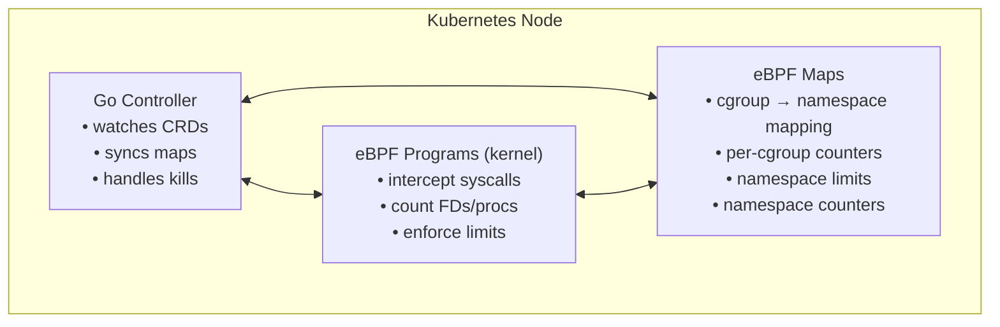
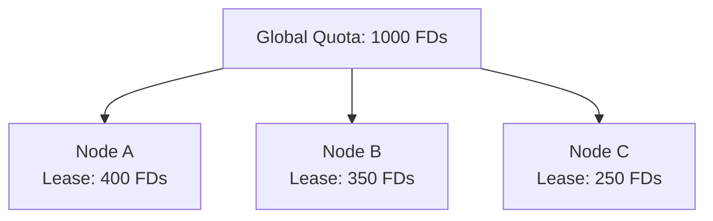
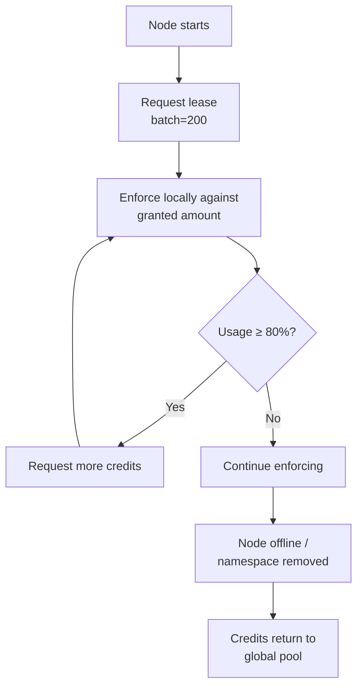

# object-quota-manager

An eBPF-powered Kubernetes agent that enforces per-namespace limits on file descriptors and processes.

In shared clusters, one misbehaving namespace can starve others by opening too many file descriptors or spawning too many processes. This project prevents that by enforcing hard quotas at the kernel level.

---

## How It Works

### The Problem

Kubernetes namespaces share kernel resources. A single namespace exhausting file descriptors or processes can impact every other namespace on the node.

### The Solution

A lightweight agent runs on each node and enforces quotas defined by a custom resource (`ObjectQuota`). Enforcement happens in two layers:

1. Kernel (eBPF): Intercepts syscalls (`fd_install`, `kernel_clone`) and counts resources per cgroup. If a namespace exceeds its quota, the offending process is killed immediately (~1 microsecond).

2. Userspace (Go controller): Watches `ObjectQuota` CRDs and pod events, manages eBPF maps, and handles cleanup when pods or namespaces are removed.

The kernel layer provides instant enforcement. The userspace layer provides orchestration and intelligence, it can identify the actual abuser across multiple pods and kill the right one.

---

## Architecture

On each node, the agent runs two components:



The eBPF layer runs in the kernel and intercepts every `open()` and `fork()` syscall. It maintains per-cgroup counters and compares them against namespace limits. When a limit is breached, the process is killed instantly.

The Go controller runs in userspace and keeps the eBPF maps in sync with Kubernetes state. It watches `ObjectQuota` CRDs for quota definitions and pod events for cgroup mappings. When a breach event comes from eBPF, the controller can identify the actual abuser across multiple pods.

### Lease-Based Quota Distribution

A namespace's quota is global, all pods across all nodes share the same limit. But eBPF enforcement is local to each node. The agent solves this with a lease-based quota distribution system:



How it works:

1. Lease Request: Each node requests a batch of credits from the global pool when it starts or needs more capacity
2. Local Enforcement: The node writes its granted lease to eBPF and enforces locally against that limit
3. Watermark Expansion: If a node uses ≥80% of its lease, it requests more credits from the pool
4. Credit Return: When a node goes offline or a namespace is removed, unused credits return to the global pool

Lease lifecycle:



Node failure handling: Each node's agent renews its lease periodically via a Kubernetes Lease object. When a node stops renewing (crash, network partition), surviving nodes detect the expired lease and reclaim its credits automatically.

---

## Getting Started

### Prerequisites

- Linux with eBPF support (kernel 5.10+)
- cgroup v2
- Kubernetes cluster (k3s, kind, or similar)
- `kubectl` access

### Install the CRD

```bash
kubectl apply -f config/crd.yaml
```

### Create a Quota

```yaml
apiVersion: quota.melonlorrd.dev/v1alpha1
kind: ObjectQuota
metadata:
  name: my-quota
  namespace: my-namespace
spec:
  fileDescriptors: 1000    # max open FDs across all pods in ns
  processes: 200           # max concurrent processes across all pods in ns
```

```bash
kubectl apply -f my-quota.yaml
```

### Run the Agent

```bash
make build
sudo -E ./object-quota-manager    # root required for eBPF
```

The agent watches for `ObjectQuota` CRDs and pod events, loading eBPF programs and synchronizing maps automatically.

---

## Considerations

Cgroup resolution: The resolver probes 8 hardcoded cgroupfs path patterns. If kubelet uses a non-standard layout or the pod's cgroup isn't created yet at reconciliation time, resolution fails silently. A background scanner (1s ticker) retries but doesn't guarantee coverage.

---

## Testing

```bash
make test          # Unit tests
make bench         # Benchmarks
make test-e2e      # End-to-end
```
